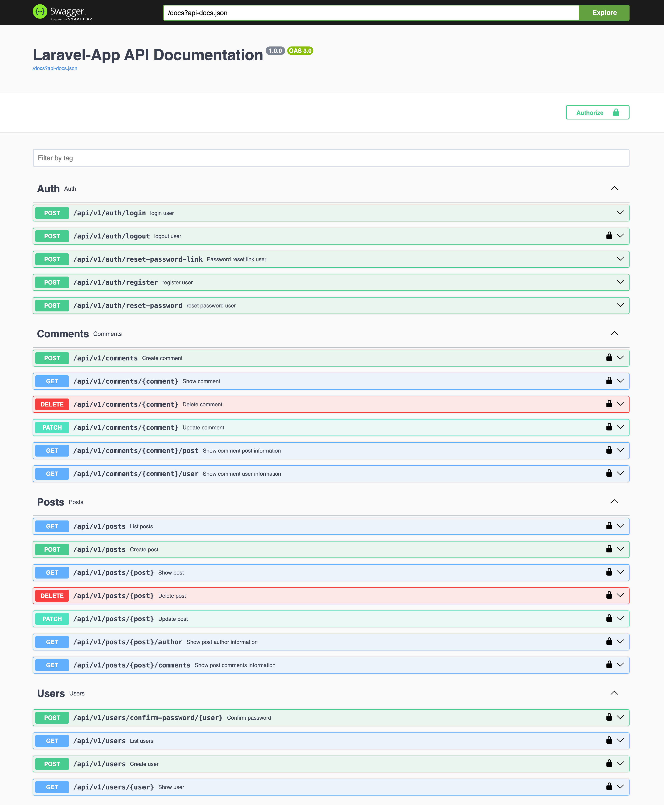
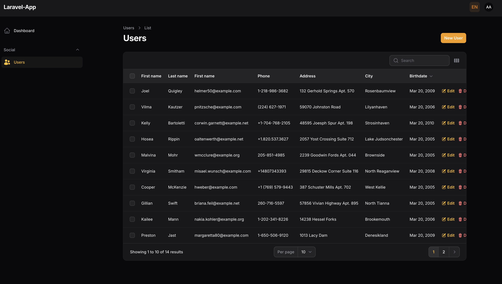

# 🏅 Weetals – Talent Discovery Platform

Weetals is a talent discovery and promotion platform, initially focused on sports, designed with a **scalable, event-driven architecture** and an **API-first approach**.

🔗 [Demo API](https://setup-laravel-app-production.up.railway.app/api/v1/documentation)
🔗 [Demo Admin Panel](https://setup-laravel-app-production.up.railway.app/admin)

---

## 🚀 Key Features

- **API-First Design**
  RESTful API built with [Laravel JSON:API](https://laraveljsonapi.io/) following the JSON:API v1 standard.
  The API is designed as a **gateway layer**, enabling a future migration to **microservices**.

- **Event-Driven Architecture (EDA)**
  - **Jobs & Queues**: Asynchronous processing with [Laravel Horizon](https://laravel.com/docs/horizon).
  - **Observers**: Model observers to track lifecycle events.
  - **Listeners**: Event-based triggers for decoupled workflows.

- **Real-Time Capabilities**
  Native WebSockets with [Laravel Reverb](https://laravel.com/docs/reverb) for real-time updates (evaluations, notifications, chat).

- **Robust Authentication & Authorization**
  - Authentication via [Laravel Fortify](https://laravel.com/docs/fortify) and [Sanctum](https://laravel.com/docs/sanctum).
  - Role & permission management with [Spatie Permissions](https://spatie.be/docs/laravel-permission).

- **Admin & Management**
  - [Filament](https://filamentphp.com/) admin panel with custom UI library.
  - [L5 Swagger](https://github.com/DarkaOnLine/L5-Swagger) for API documentation.

- **Scalable Infrastructure**
  - Dockerized development & deployment.
  - Modular service design with separation of concerns.
  - Event-driven gateway prepared for **microservices**.

- **Testing & Quality**
  - +35 automated tests (Feature & Unit).
  - Database migrations, factories & seeders for reproducibility.
  - CI/CD-ready structure.

---

## 🛠️ Requirements

- Docker
- Docker Compose
- [Filament PHP](https://filamentphp.com/docs)
- [Laravel JSON:API](https://laraveljsonapi.io/5.x/)
- [Laravel](https://laravel.com/)

---

## 🚀 How to Run

```bash
# After cloning the project
cd ./setup-weetals

# Add the project to the hosts file
sudo sh -c "echo '127.0.0.1 weetals.local' >> /etc/hosts"

# Install Sail
docker run --rm \
    -u "$(id -u):$(id -g)" \
    -v "$(pwd):/var/www/html" \
    -w /var/www/html \
    laravelsail/php83-composer:latest \
    composer install --ignore-platform-reqs

# Setup environment variables
cp .env.example .env

# Build containers
make setup

# Start all containers
make up

# Run migrations and seed database
make migrate
make seed

# Alternatively, run migrations and seed in one command
make db_fresh

# Migrate test database
make db_fresh_test

# Stop all containers
make stop

# Run frontend in development mode
make front-dev
```

## Web Access

### API
```bash
http://weetals.local:8080/api/v1/documentation
```


### Admin Panel
```bash
http://weetals.local:8080/admin/login

User: admin@weetals.com
Password: password
```


## Command Installation & Artisan Commands

```bash
# Example: Install a package
make sail command="composer require api-platform/laravel"

# Example: Run an Artisan command
make sail command="artisan tinker"

# Run Scout jobs
make sail command="artisan queue:work redis --queue=scout"

# Generate application key
make sail command="artisan key:generate"
```

## Create Sail Alias

```bash
#create alias
alias sail="./vendor/bin/sail"
```

## Execute Commands with Sail

```bash
# Run database migrations
sail artisan migrate:fresh

# Install a package
sail composer require api-platform/laravel

# Generate an API token
sail artisan app:token-api-generator admin@weetals.com password
```

## Additional Commands
Refer to the `Makefile` for more available commands.

## 📌 Roadmap

- ✅ Core API with JSON:API (Gateway layer)
- ✅ Authentication & Role Management (Fortify, Sanctum, Spatie Permissions)
- ✅ Admin Panel with Filament
- ✅ Event-driven system (Jobs, Observers, Listeners)
- ✅ API Documentation with Swagger
- 🚧 Real-time chat & notifications (Laravel Reverb)
- 🚧 Training plans & projections for Talents
- 🚧 Club events & sponsorship system
- 🚧 Advanced analytics & dashboards
- 🚧 Migration to microservice-based architecture
